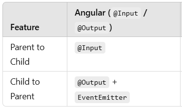

# Lec3


a. CoreComponent

Handles user input and emits events (serverCreated and blueprintCreated) when a user clicks a button.

It uses event binding ((click)) to trigger onAddServer() and onAddBlueprint().

Data Flow:

User types into the inputs.

Clicks "Add Server" or "Add Blueprint".

Emits an event with the entered data to the parent (AppComponent).

b. ServerElementComponent

Displays each server or blueprint added.

Uses @Input() to receive data from AppComponent.

c. AppComponent

Acts as the central data manager.

Stores the serverElements array, which holds all added servers/blueprints.

Listens for the emitted events from CoreComponent and updates the serverElements list.

Data Flow
1. User enters a server name and content.
2. Clicks "Add Server" or "Add Blueprint".
3. The CoreComponent emits an event (serverCreated or blueprintCreated).
4. The AppComponent listens to the event and adds a new server/blueprint to serverElements.
5. The serverElements list is updated.
6. AppComponent passes serverElements to ServerElementComponent using [element] binding.
7. ServerElementComponent displays each item.



This project was generated using [Angular CLI](https://github.com/angular/angular-cli) version 19.1.4.

## Development server

To start a local development server, run:

```bash
ng serve
```

Once the server is running, open your browser and navigate to `http://localhost:4200/`. The application will automatically reload whenever you modify any of the source files.

## Code scaffolding

Angular CLI includes powerful code scaffolding tools. To generate a new component, run:

```bash
ng generate component component-name
```

For a complete list of available schematics (such as `components`, `directives`, or `pipes`), run:

```bash
ng generate --help
```

## Building

To build the project run:

```bash
ng build
```

This will compile your project and store the build artifacts in the `dist/` directory. By default, the production build optimizes your application for performance and speed.

## Running unit tests

To execute unit tests with the [Karma](https://karma-runner.github.io) test runner, use the following command:

```bash
ng test
```

## Running end-to-end tests

For end-to-end (e2e) testing, run:

```bash
ng e2e
```

Angular CLI does not come with an end-to-end testing framework by default. You can choose one that suits your needs.

## Additional Resources

For more information on using the Angular CLI, including detailed command references, visit the [Angular CLI Overview and Command Reference](https://angular.dev/tools/cli) page.
